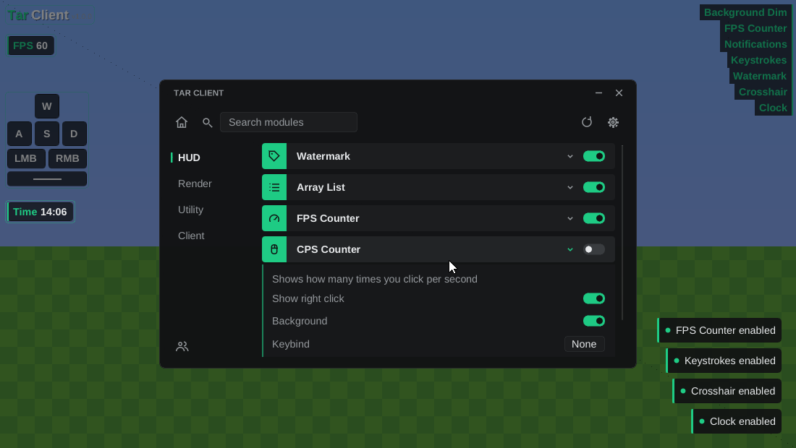

# Tar Client

An injectable ImGui overlay/click GUI for Minecraft **Bedrock** and **Java** on Windows. It builds two DLLs that share the same menu, modules and config code:

- `TarClient.dll` for Bedrock hooks the game's DirectX 12 (or DirectX 11) swap chain
- `TarClientJava.dll` for Java hooks `wglSwapBuffers` and draws with its own OpenGL context, so it works on any version (1.8 through current, with or without mods)

- Click GUI with a home page, search, categories, settings, and friends pages
- Module system with settings (toggle, slider, mode, and color), keybinds, and animations
- Draggable HUD elements
- Config that saves on its own (module states, keybinds, settings, accent color, and friends)
- Toast notifications and an accent color you can change
- A small injector that finds either edition

To add your own modules, see **[MODULES.txt](MODULES.txt)**.



## Built-in modules

| Tab | Modules |
| --- | --- |
| HUD | Watermark, Array List, FPS Counter, CPS Counter, Keystrokes |
| Render | Crosshair, Background Dim |
| Utility | Clock, Session Timer |
| Client | Notifications, Rainbow Theme |

All of them only draw overlays. None of them read or change game memory.

## Building

You need Visual Studio 2022 (with the "Desktop development with C++" workload), CMake 3.20+, and git. On the first configure, CMake downloads Dear ImGui and MinHook.

```bat
cmake -S . -B build -A x64
cmake --build build --config Release
```

This gives you `TarClient.dll` (Bedrock), `TarClientJava.dll` (Java) and `TarInjector.exe` in `build/Release/`.

MinGW-w64 works too: `cmake -S . -B build -G Ninja -DCMAKE_BUILD_TYPE=Release`

## Using it

1. Start Minecraft (Bedrock or Java).
2. Put `TarInjector.exe` next to the DLLs and run it. It picks Bedrock if Bedrock is running, otherwise it looks for a Java game window.
   - To force one, use `TarInjector.exe --java` or `TarInjector.exe --bedrock`. You can also pass a DLL path.
   - For another LoadLibrary injector, pick `Minecraft.Windows.exe` for Bedrock, or the game's `javaw.exe` for Java.
3. In game, press **Insert** to open the menu. You can change this key on the settings page.

Controls:
- Insert or Esc closes the menu.
- Click a module's row to open its settings. The switch turns it on or off.
- To bind a key, click the keybind box, then press a key. Esc or Backspace clears it.
- While the menu is open, drag HUD elements around.
- "Unload client" on the settings page takes the DLL out cleanly.

The config is saved to `%APPDATA%\TarClient\config.txt` (Bedrock) or `config_java.txt` (Java). Older UWP Bedrock builds use the game's `RoamingState` folder instead.

## Project layout

```
src/
  dllmain.cpp            entry point, starts the client thread
  core/Client.*          glue between the hooks, modules and the gui
  hooks/Renderer.h       install / uninstall, implemented once per edition
  hooks/Common.*         shared: minhook, wndproc input, cursor hooks, imgui context
  hooks/dx/              bedrock: dx12/dx11 present hook with d3d11on12
  hooks/gl/              java: wglSwapBuffers hook with a separate gl context
  gui/ClickGui.*         the menu
  gui/Widgets.*          toggles, sliders, keybind boxes...
  gui/Icons.*            line icons drawn with the draw list
  gui/Theme.*            colors, fonts, imgui style
  module/                Module / HudModule / settings / ModuleManager
  module/modules/<tab>/  the modules
  config/Config.*        save / load
injector/Injector.cpp    loadlibrary injector
```

## Notes

- Only use this where client mods are allowed. Many servers ban them.
- Bedrock updates can change how the game renders. If the overlay stops showing up after an update, look at the swap chain hook in `hooks/dx/RendererDX.cpp` first.
- Some Java launchers and clients (Lunar, Badlion, and others) have their own anticheat that blocks injected DLLs. Use the vanilla launcher or a normal mod loader.
